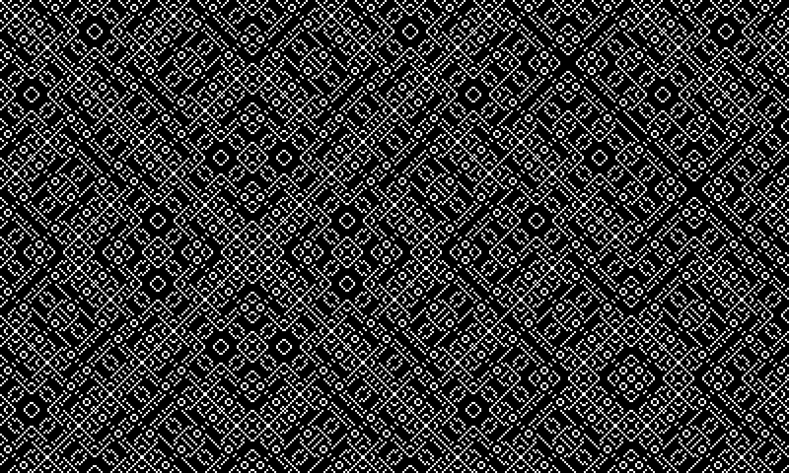
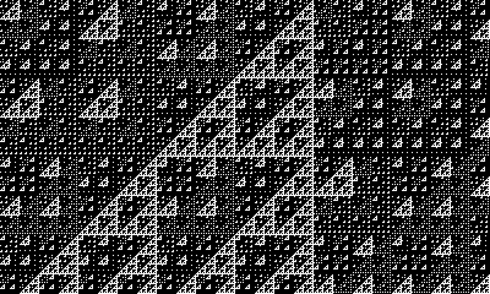

# Pixel Logic Patterns

[Pixel Logic Pattern](https://piebro.github.io/pixel-logic-patterns/) is a simple website to generate complex patterns using bitwise operations. It works by evaluating a formula like `(x ^ y) % v` for every pixel value, where `x` and `y` are the coordinates and `v` is an additional flexible value. If the result of the formula is `0`, the pixel is colored white; otherwise, it remains uncolored.

JavaScript supports a range of bitwise operations which can be used, including AND (`&`), OR (`|`), XOR (`^`), NOT (`~`), and bit shifts (`<<`, `>>`).

Example using the formula `(x ^ y) % 5`

and another example using the formula `(x | y) % 5`

The project is inspired from https://github.com/gingerbeardman/mandala, which does the same thing using lua and inspired me to this website.

## Contributing

Contributions to this project are welcome. Feel free to report bugs, suggest ideas, or create merge requests.

## Developing

The project uses [Prettier](https://prettier.io/playground/) for linting JavaScript with a `print-width` of 120, `tab-width` of 4, and using single quotes.

## Website Statistics

There is lightweight tracking for the website using Plausible. Anyone interested can view these [statistics](https://plausible.io/piebro.github.io%2Fpixel-logic-patterns). It's worth noting that these statistics might be an underestimate as many users, including myself, use AdBlockers.

## License

This project is licensed under the MIT License - see the [LICENSE](LICENSE) file for details.
